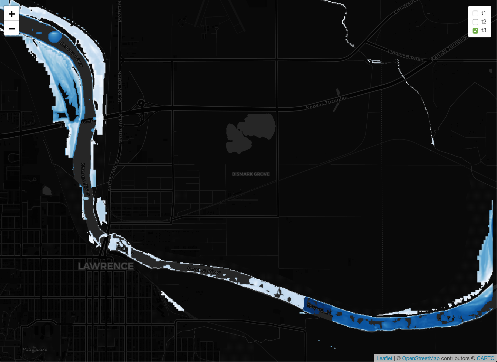

# Flood Mapping 

[](https://travis-ci.org/mikejohnson51/FloodMapping)
[](https://zenodo.org/badge/latestdoi/130427796)

The advent of the National Water Model and the development of the Height Above Nearest Drainage products (HAND) offer the ability to map flood extents for anywhere in the lower 48 United States. The challenges with this methodology stem from the acquisition, management and application of large scale data sets. 

FloodMapper is designed to help users get the data they need, archive it on their local machines, and then process flood extents. In executing the steps in this process the first time the process in run the data is  collected and formatted - meaning it is slow. After the intital pass,  users can quickly generate flood maps for their region from real-time National Water Model output (nomadsNC), staged historic data (nwmHistoric), and can adjust forecasted values to build pre-stages maps (adjust). 

This package is a continuation of the 'LivingFlood' project demonstrated at the 2017 CUASHI HydroInformatics Conference in Tuscaloosa, AL.

### Installation:

```{r}
remotes::install_github("mikejohnson51/FloodMapping")
```

### use case for Kansas 

```{r}
library(leaflet)

AOI = AOI::aoi_get("Lawrence, KS")
project.name = "KU"

raw.dir = '/Users/mikejohnson/Desktop/test_nomads/'

files = getRawData(AOI, raw.dir, project.name)

files$flows.path = nomadsNC::create_nomads_fst(
  type = "analysis_assim",
  num  = 3,
  dstfile = paste0(raw.dir, project.name, '/flows.fst')
)

maps  = map_flood(
  hand.path      = files$hand.path,
  catchment.path = files$catch.path,
  rating.path    = files$rating.path,
  flows.path     = files$flows.path
)

leaflet() %>%
  addProviderTiles(providers$CartoDB.DarkMatter) %>%
  mapview::addStarsImage(stars::st_as_stars(maps[[1]]),
                         group = 't1',
                         colors = blues9) %>%
  mapview::addStarsImage(stars::st_as_stars(maps[[2]]),
                         group = 't2',
                         colors = blues9) %>%
  mapview::addStarsImage(stars::st_as_stars(maps[[3]]),
                         group = 't3',
                         colors = blues9) %>%
  addLayersControl(overlayGroups = c('t1', 't2', 't3'))

```



### The HAND datasets are a product of:

Liu, Yan Y., David R. Maidment, David G. Tarboton, Xing Zheng, and Shaowen Wang. 2018. A CyberGIS Integration and Computation Framework for High-Resolution Continental-Scale Flood Inundation Mapping. Journal of the American Water Resources Association (JAWRA). Accepted.

Liu, Yan Y., David R. Maidment, David G. Tarboton, Xing Zheng, Ahmet Yildirim, Nazmus S. Sazib and Shaowen Wang. 2016. A CyberGIS Approach to Generating High-resolution Height Above Nearest Drainage (HAND) Raster for National Flood Mapping. The Third International Conference on CyberGIS and Geospatial Data Science. July 26–28, 2016, Urbana, Illinois. http://dx.doi.org/10.13140/RG.2.2.24234.41925/1

### Support:

The "AOI" R package is written by [Mike Johnson](https://mikejohnson51.github.io), a graduate Student at the [University of California, Santa Barbara](https://geog.ucsb.edu) in [Keith C. Clarke's](http://www.geog.ucsb.edu/~kclarke/) Lab, 2018. <br><br>
Development is supported with funds from the [UCAR COMET program](http://www.comet.ucar.edu); the [NOAA National Water Center](http://water.noaa.gov); and the University of California, Santa Barbara and is avaliable under the [MIT license](https://opensource.org/licenses/MIT)
