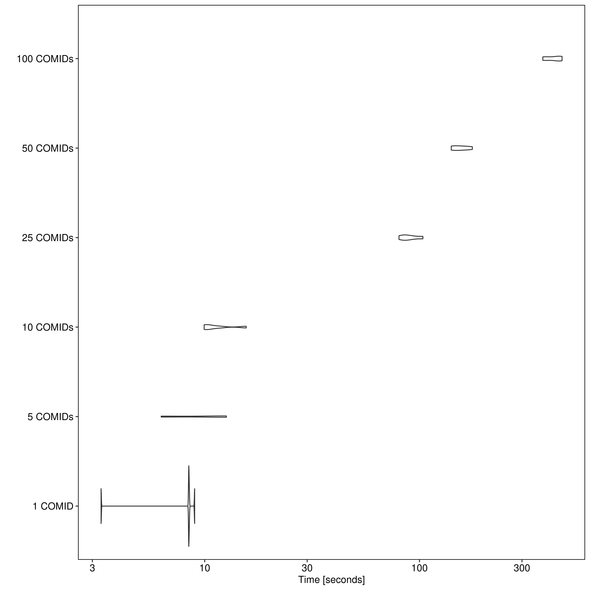

```{r, include = FALSE}
library(dplyr)
library(FloodMapping)
```

## Generating SRCs

For this example, we will use the [Mobile River](https://en.wikipedia.org/wiki/Mobile_River)
as our area of interest (AOI). We need to first get the HAND raster associated with our AOI:

```{r, eval = FALSE}
mobile_river   <- AOI::aoi_get("Mobile River")
mobile_rv_hand <- get_hand_raster(mobile_river)
```

Now, we can start generating synthetic rating curves. This is as simple as passing the HAND raster to the `get_src()` function,
using `find_comids` to retrieve the COMIDs for an AOI, or both:

```{r, eval = FALSE}
# Using our HAND raster only
get_src(hand = mobile_rv_hand)

# Retrieving COMIDs
get_src(comids = find_comids(mobile_river))

# Both (This will be faster, if we have a list of COMIDs already)
get_src(comids = find_comids(mobile_river), hand = mobile_rv_hand)
```

> Note: this function is **not** currently optimized to handle >50 COMIDs at one point. Below we will look at
> some benchmarks to show the time it takes.

We can see an example of an SRC from COMID *18523225* within our AOI:

```{r, warning = FALSE, message = FALSE}
aoi_src <- get_src(comids = 18523225, progress = FALSE)

knitr::kable(head(aoi_src))
```

## Benchmarking

```{r, eval = FALSE}
mobile_benchmark <- microbenchmark::microbenchmark(
    get_src(comids = find_comids(mobile_river)[1]),
    get_src(comids = find_comids(mobile_river)[1:5]),
    get_src(comids = find_comids(mobile_river)[1:10]),
    get_src(comids = find_comids(mobile_river)[1:25]),
    get_src(comids = find_comids(mobile_river)[1:50]),
    get_src(comids = find_comids(mobile_river)[1:100]),
    times = 5L
)
```

|  # of COMIDs |         Min |        Mean |         Max |
| :----------- | :---------- | :---------- | :---------- |
|    *1 COMID* |   3.293183s |   7.521509s |   8.981336s |
|   *5 COMIDs* |   6.273153s |   9.911828s |  12.611718s |
|  *10 COMIDs* |   9.941075s |  11.566530s |  15.605586s |
|  *25 COMIDs* |  80.290648s |  89.990548s | 103.734189s |
|  *50 COMIDs* | 140.564587s | 155.644141s | 176.225388s |
| *100 COMIDs* | 375.030785s | 421.307919s | 461.002568s |

```{r, out.width = "750px", echo = FALSE, fig.align = "center", fig.cap = "**Figure 1:** SRC Generation Benchmarks *(32GB Memory)*"}

```