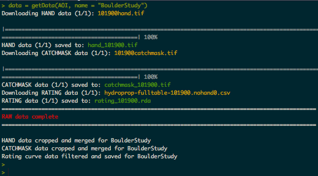
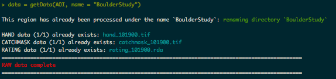
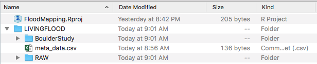
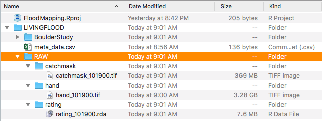
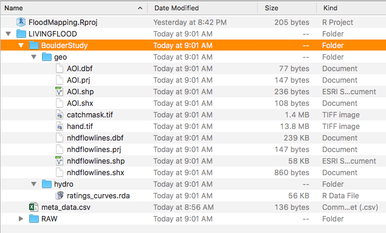

```{r echo = FALSE, results='hide', warning= FALSE,message=FALSE}
knitr::opts_chunk$set(
  collapse = TRUE,
  comment = "#>",
  fig.width = 6,
  warning = FALSE
)

devtools::load_all(".")
```

## Defining and Area of Interest

To reduce the size of the data needed,LivingFlood has been designed to compliment the AOI package. AOI allows users to define an area of interest by a location and/or boundng box dimisions to yeild a spatial geometry. A detailed look at this process can be found [here](...). For this example we are interested in the  100 square mile regions surrounding Boulder, Colorado.

```{r, eval = F}
AOI = getAOI(list("Boulder", 10, 10))
```

To make sure that our AOI is defined as we hoped we can use the AOI::check() fucntion:

```{r, eval = F}
check(AOI)
```

All looks good! We will use this AOI for the rest of the examples

## Get RAW data

With a defined AOI now need to grab the needed HAND data. Specifically we need three prodcts. 

  1. The HAND raster itself
  2. The NHD catchemnt raster
  3. The synthetic rating curve file for each NHD reach
  
All of these will be collected and processed using the `getData` function. Depending on your internet connection this process can take a while as some rasters are over a GB in size. Fortunatly, if you are set up in a RStudio Project this step will only have to e carried out once. 

The required input is an AOI geometry. Optionally, a name can be provided for the region, this name will be used to archive the processed data in your main working directory. If left NULL the name "RegionXXX" will be used starting at 'Region001' and increasing by one for each new AOI processed.

```{r, eval = F}
data = getData(AOI, name = "BoulderStudy")

```

```{r, out.width = "600px", echo = FALSE}

```


As previously mentioned the convince of this porgram and sticking to the RProj folder is that if you try to download the same file again, the raw directory is checked first and only the needed files are downloaded. 

```{r, eval = F}
data = getRawData(AOI, name = "BoulderStudy")
```

```{r, out.width = "600px", echo = FALSE}

```


## Folder Structure

Once downloaded you should check the RProj folder. In it you will find a top level directory called `LIVINGFLOOD`. In it you will find three subdirectories/files. 

  1. The RAW folder which holds the complete dataset downloaded from the HAND repository
  2. A folder named after the AOI (either a supplied name or 'RegionXXX')
  3. A meta.data csv outlining the regions that have been processed.

```{r, out.width = "600px", echo = FALSE}

```


###Metadata CSV

The csv is a dynamic file that updates according to the contents of the LIVINGFLOOD directory. Looking at this file we'll see the name of the region processed, the center latitute and longitude corrdinates; the height and width in miles of the geometry, the associated HUC unit, and the number of unique NHD reaches. Not only is this file useful for reference and for reporducing AOI calls, but it is used to avoid ducplicating downlaods. Before any downlaod occurs the getData script referecnes this file and stops if the data has already been processed. Even if you change the name the program will recongnize the geometry and stop the program while renmaing the folder to match the new name.

```{r, eval = FALSE}
read.csv("./LIVINGFLOOD/meta_data.csv")
```

```{r, echo = FALSE}
read.csv("/Users/mikejohnson/Documents/GitHub/LivingFlood/vignettes/meta_data1.csv")
```

```{r, eval = F}
data = getData(AOI, name = "Boulder100mile2")
read.csv("./LIVINGFLOOD/meta_data.csv")
```

```{r, echo = FALSE}
read.csv("/Users/mikejohnson/Documents/GitHub/LivingFlood/vignettes/meta_data2.csv")
```

```{r, eval = F}
data = getAOI('Denver') %>% getData(name = "denver")
```
```{r, eval = F}
read.csv("./LIVINGFLOOD/meta_data.csv")
```

### RAW Data

Looking more closly at the RAW folder we find three sub folders each with HAND, CATCHMASK, or RATING-CURVE raw data for all regions that have been requested in the past. These are stored here so that any new region within a HUC6 that has already been procesedded can be quickly processed:

```{r, out.width = "600px", echo = FALSE}

```

### Processed Data

```{r, out.width = "600px", echo = FALSE}

```

