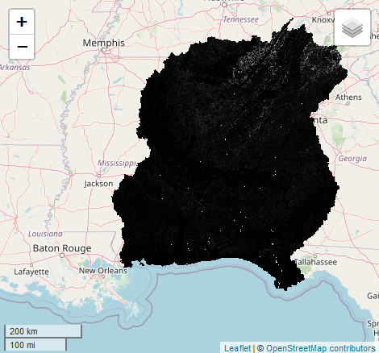
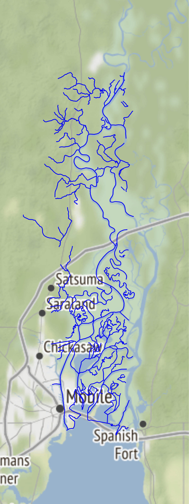
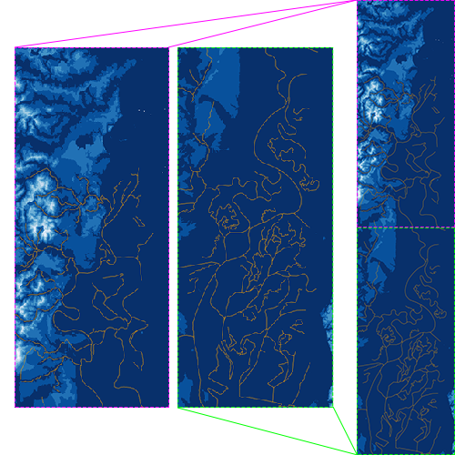

```{r, include = FALSE}
library(dplyr)
library(FloodMapping)
```

## Context

The development of the HAND datasets has provided extraordinary
support in the use of flood mapping. However, the current HAND rasters can vary
in storage size, and be upwards of 20 GBs or more! To mitigate the need for large
storage and increasing computation speed, we have generated a set of GeoTIFF
format HAND tiles, stored in an [AWS S3 bucket](https://s3-tilemap.s3.amazonaws.com).

```{r, out.width = "400px", echo = FALSE, fig.align = "center", fig.cap = "**Figure 1:** HAND Tiles Coverage"}

```

> Currently, **as of 3/9/2021**, the HAND tiles only cover the HUC6 regions overlapping Alabama.

## Getting HAND Tiles

Lets start with defining an area of interest (AOI). We'll use the [Mobile River](https://en.wikipedia.org/wiki/Mobile_River)
as our AOI:

```{r, eval = FALSE}
mobile_river <- AOI::aoi_get("Mobile River")
```

```{r, out.width = "200px", echo = FALSE, fig.align = "center", fig.cap = "**Figure 2:** Mobile River"}

```

Given this AOI, we can now easily grab the HAND tiles from the AWS S3 bucket:

```{r, eval = FALSE}
mobile_rv_hand <- get_hand_raster(mobile_river)
```

We get the following HAND raster after calling this function:

```{r, out.width = "500px", echo = FALSE, fig.align = "center", fig.cap = "**Figure 3:** Zoomed in HAND Raster. The orange feature represents our AOI."}

```

Now, we can work with this HAND in mapping floods as opposed to downloading the HAND rasters covering entire HUC2 regions.

## Benchmarking

Given a 100 Mbit/s connection, the benchmark (evaluated 5 times) for `get_hand_raster()` for this AOI is as follows:

```
Unit: seconds
                         expr       min        lq      mean    median        uq       max  neval
get_hand_raster(mobile_river)  11.56501  11.78434  11.84891  11.86188  11.93124  12.10206      5
```
This gives that, for the **115** tiles for this AOI, it took approximately **103.034 ms per tile** to download, and a total time of **11848.91 ms**.

The corresponding HUC6 (*031602*) HAND dataset is **8.3 GB** (from the [CFIM Repository](https://cfim.ornl.gov/data/)), which
would take an estimated **712000 ms** to download.

For a more fair comparison, consider if we downloaded *only* the HAND raster directly from the
[University of Texas at Austin's](http://web.corral.tacc.utexas.edu/nfiedata/HAND/) HAND repository.
This download is **749.9 MB**, which would take an estimated **62000 ms** to download. To summarize:

Repository           | Time Taken / Estimated Time | Relative to S3
:------------------- | :-------------------------- | :------------
S3 HAND Tiles        | **~12000 ms**               | N/A          
CFIM Repository      | **~712000 ms**              | *~59.3x*     
UT Austin Repository | **~62000 ms**               | *~5.2x*      

Clearly, we can see the benefit of tiling in the case of working with county-level AOIs. In the case of larger AOIs, it would
potentially be better to download the HAND rasters directly from either repository.

*Note: the UT Austin repository is an outdated version of the HAND rasters. The latest version can be found on the CFIM repository web page.*

*Estimated download times are retrieved from [here](https://www.download-time.com/)*