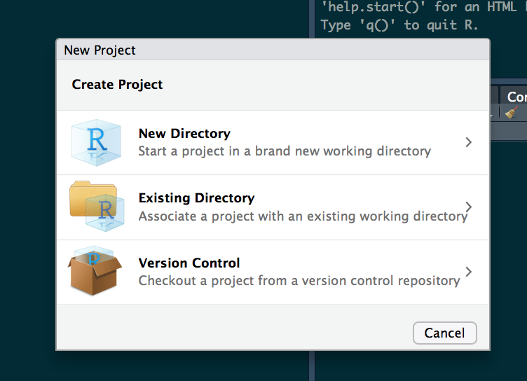

```{r echo = FALSE, results='hide', warning= FALSE,message=FALSE}
knitr::opts_chunk$set(
  collapse = TRUE,
  comment = "#>",
  fig.width = 1

)
```

## Background

In August 2016 NOAA introduced the National Water Model aimed at impact-based forecasting of weather and water events. The NWM runs on NOAA’s centralized Weather and Climate Operational Supercomputing System (WCOSS) utilizing the community [WRF-Hydro modeling system](https://www.ral.ucar.edu/projects/wrf_hydro). It delivers stream flow forecasts for the 2.7 million [NHDPlusv2](http://www.horizon-systems.com/nhdplus/) river reaches as well as 1-kilometer gridded analyses for a range of hydrologic variables across the CONUS. Each day this data amounts to over 400GB worth of data that needs to be made sense of.
  One of primary, and perhaps obvious, needs for an impact-based forecasting system is the ability to predict not only flood occurrences but flood extents. Along this vein, the NFIE (National Flood Interoperability Experiment) Height Above Nearest Drainage (HAND) methodology offers a geospatial product to convert stream flow to river stage, and river stage to flood extents, based largely on a detailed topographic analysis. This analysis has been executed for the entirety of CONUS across the 10m USGS 3DEP national elevation data set (NED) and is available [here](https://web.corral.tacc.utexas.edu/nfiedata/). For more information on this please refer [here](https://onlinelibrary.wiley.com/doi/abs/10.1111/1752-1688.12660), [here](https://onlinelibrary.wiley.com/doi/10.1111/1752-1688.12661), and [here](https://web.corral.tacc.utexas.edu/nfiedata/docs/NFIE-CFIM-JAWRA-YanLiu-20170619.pdf). This intermediate and final results of this analysis add up to 4.9 TB of data. 
  
The challenge then is getting these two massive data set to integrate in a way that can provide detailed and timely, flood forecasts. This package aims to meet this need by providing an interface between the NFIE HAND products and the NOAA forecasts to generate forecasted flood maps for an Area of Interest (AOI). AOIs are determined using the [AOI package](https://mikejohnson51.github.io/AOI/) and National Water Model data is collected via a wrapper around the [NWM package](https://github.com/mikejohnson51/NWM) both of which are dependencies for the package.


This package in conceptualized as a way of dealing with static HAND data once, and then being able to process temporal NWM data for the same area quickly over and over. To accomplish this this package enforces a folder hierarchy and a workflow that is dependent on this set up. Most simply though it just means that all work should be run from a single working directory. The easiest way to do this is to run all of your flood mapping work from and RStudio Project (generally good practice for all levels of R development). At there most basic level RStudio Projects allow you to work from a defined working directory, workspace, history, and source documents. 

To create a new RStudio Project, launch R studio, and select 'FILE > NEW PROJECT'. From the popup dialogue elect to create a project in a new directory, select a NEW PROJECT.

```{r, out.width = "400px", echo=FALSE}

```


Name it something generic (eg 'FloodMapping') and select the directory where the folder should go on your local machine: 


```{r, out.width = "400px", echo = FALSE}
knitr::include_graphics("imgs/setup.png")
```

After that, select create and navigate to the location you instructed. In the folder you will see an Rproj file. Double click it to launch the associated RStudio project, from here you are ready to go! Each time you want to work with HAND and NWM data for flood  mapping doing so from this project will ensure you have access to all the raw and processed data you have already generated. 

## Getting started with Living Flood

To get started with the LivingFlood package open a new script and enter the following to download the source code from Github:

```{r, eval = F}
intstall.packages('devtools')
devtools::install_github("mikejohnson51/FloodMapping")

```


Now each time you start R you can access the LivingFlood Package by calling the library:

```{r, eval = F}
library(LivingFlood)
```

Now we are ready to start processing data and mapping floods!!


